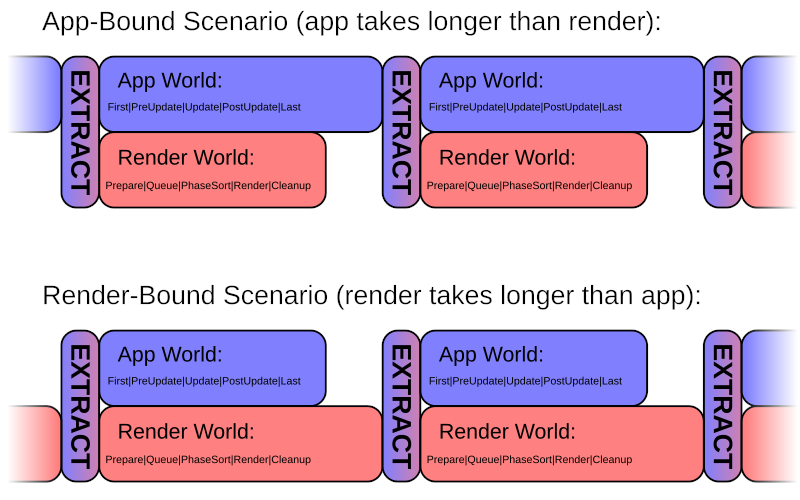

# Schedule

所有由 Bevy 运行的系统都包含在 Schedules 中，并通过 Schedules 进行组织。Schedules 是系统的集合，包含它们应如何运行的元数据，以及用于运行系统的关联执行算法。

一个 Bevy 应用程序有许多不同的 Schedules ，用于不同的目的，在不同的情况下运行它们。

## 系统配置
您可以向系统添加元数据，以影响它们的运行方式。

这可以包括：

- 运行条件：控制系统是否应运行

- 排序依赖关系：如果系统应在同一 Schedule 中的特定其他系统之前/之后运行

- 系统集：将系统分组在一起，以便可以对所有系统应用通用配置

当 Schedule 运行时，执行算法会在确定系统是否准备运行时遵循所有这些配置。系统在以下所有条件都满足时准备就绪：

- 没有其他当前运行的系统以可变方式访问相同的数据（根据系统参数）
- 所有排序在“之前”的系统已完成或由于运行条件被跳过
- 系统的运行条件全部返回 true

当系统准备就绪时，它将在可用的 CPU 线程上运行。默认情况下，系统以非确定性顺序运行！系统可能在每帧的不同时间运行。如果您关心它与其他系统的关系，请添加排序依赖。

## Bevy 的 App 结构
Bevy 有三个主要/基础 Schedule ：Main、ExtractSchedule、Render。还有其他 Schedule ，它们在 Main 中管理和运行。

在正常的 Bevy 应用程序中，Main + ExtractSchedule + Render 在循环中反复运行。它们共同生成游戏的一帧。每次 Main 运行时，它会运行一系列其他 Schedule 。在第一次运行时，它还会首先运行一系列 Startup Schedule。

大多数 Bevy 用户只需处理 Main 的子 Schedule。ExtractSchedule 和 Render 仅与希望为引擎开发 新/自定义 渲染功能的图形开发人员相关。

## Main Schedule
Main 是所有应用程序逻辑运行的地方。它是一种元 Schedule，其任务是按特定顺序运行其它 Schedule。您不应将任何自定义系统直接添加到 Main。您应该将系统添加到 Main 管理的各种 Schedule 中。

Bevy 提供以下 Schedule 来组织所有系统：

- First、PreUpdate、StateTransition、RunFixedMainLoop、Update、PostUpdate、Last：这些 Schedule 每次 Main 运行时都会运行

- PreStartup、Startup、PostStartup：这些 Schedule 在 Main 第一次运行时运行一次

- FixedMain：Main Schedule 的固定时间步长等效项。由 RunFixedMainLoop 运行所需的次数，以赶上固定时间步长间隔。

- FixedFirst、FixedPreUpdate、FixedUpdate、FixedPostUpdate、FixedLast：Main 子 Schedule 的固定时间步长等效项。

- OnEnter(…)/OnExit(…)/OnTransition(…)：这些 Schedule 在状态变化时由 StateTransition 运行

大多数用户系统（您的游戏逻辑）的预期位置是 Update、FixedUpdate、Startup 和状态转换 Schedule。

Update：用于每帧运行的常规游戏逻辑。
Startup：在第一次正常帧更新循环之前执行初始化任务。
FixedUpdate：如果您想使用固定时间步长。

其他 Schedule 是为引擎内部功能设计的。这样分割它们可以确保 Bevy 的内部引擎系统在与您的系统一起运行时能够正确运行，而无需您进行任何配置。请记住：Bevy 的内部实现使用普通系统和 ECS，就像您自己的东西一样！

如果您正在开发供其他人使用的插件，您可能会对在 PreUpdate/PostUpdate（或固定时间步长的等效项）中添加功能感兴趣，这样它可以与其他“引擎系统”一起运行。如果您有启动系统需要与用户的启动系统分开，也可以考虑 PreStartup 和 PostStartup。

First 和 Last 仅用于特殊边缘情况，如果您确实需要确保某些东西在所有其他内容（包括所有正常的“引擎内部”代码）之前/之后运行。

## 主调度配置
Main 每帧运行的 Schedule 顺序在 MainScheduleOrder 资源中配置。对于高级用例，如果 Bevy 的预定义 Schedule 不适合您的需求，您可以更改它。

创建新的自定义调度
例如，假设我们想添加一个额外的 Schedule ，每帧运行（像 Update 一样），但在固定时间步长之前运行。

首先，我们需要通过创建一个 Rust 类型（结构体或枚举）并派生 ScheduleLabel 和一系列所需的标准 Rust 特性，为我们的新 Schedule 创建一个名称/标签。

现在，我们可以在应用程序中初始化 Schedule ，将其添加到 MainScheduleOrder 以使其在我们喜欢的每帧运行，并向其中添加一些系统！